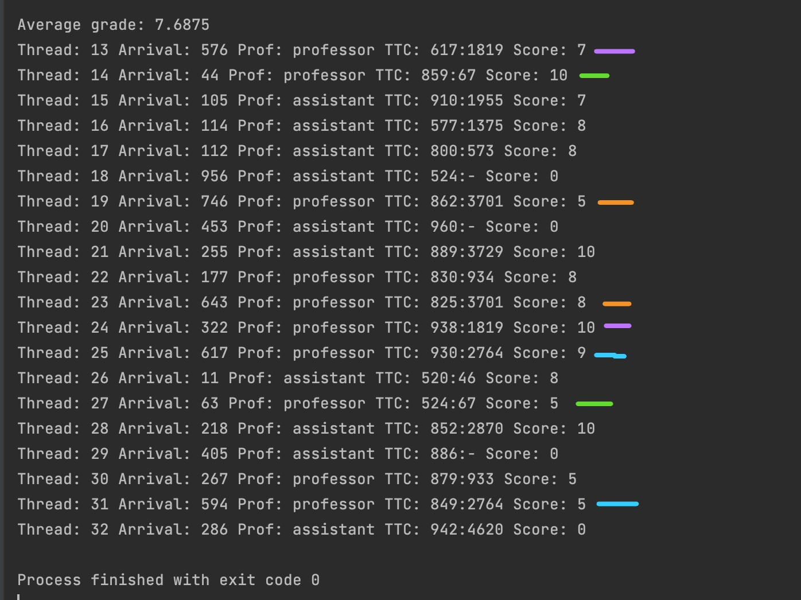

## Exercise 1: Concurrent Programming

### Overview
This exercise simulates a defense session for student homework, managed by a professor and an assistant. The system utilizes threads to handle defenses, with the professor capable of overseeing two defenses concurrently, while the assistant handles one at a time.

### Features
- Students defend their work at random intervals, with each student graded upon completion.
- The professor waits for two students before starting the review, while the assistant reviews immediately.
- Constraints ensure fairness, such as no student defending twice or after the allocated time.

### Implementation
- Utilizes a thread pool for thread management.
- Implements a cyclic barrier for the professor's review process.

### Input and Output
Input is the number of students (N), with output is:  
{Thread id} Arrival: {arrival time of the student since the start of the defense} Prof: {professor / assistant} TTC: {Time taken to review the homework}:{start time of the defense} Score: {grade}

