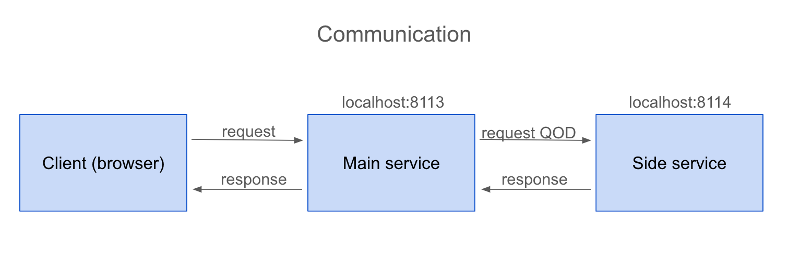
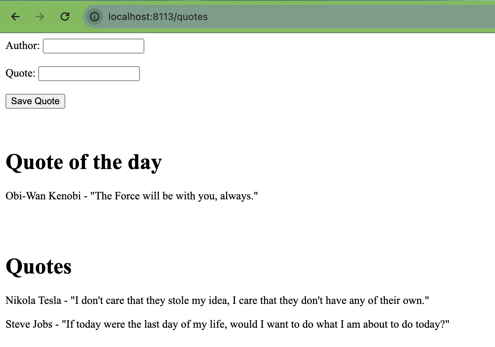

## Exercise 3: Quotes management website
Create an application allowing clients to save and view quotes. Key points:
- Users input quotes and authors, and can view all saved entries.
- Additionally, display a "quote of the day" alongside the input form.

#### Scenario
- **GET Request**: Accessing `/quotes` returns an HTML page with a form for adding quotes, the quote of the day, and all saved quotes.
- **Saving Quote**: Clicking "Save Quote" sends data to `/save-quote` via POST. The server stores the data and redirects to `/quotes` to view the saved quote.

#### Technical Requirements
Split the system into two web services (main and auxiliary) communicating via HTTP.

 