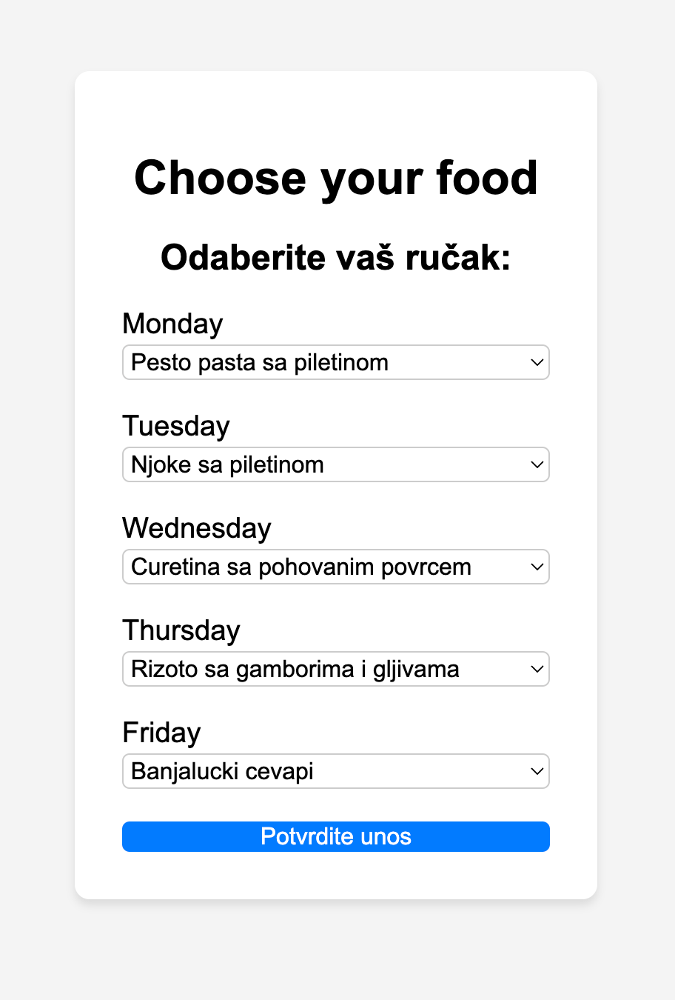
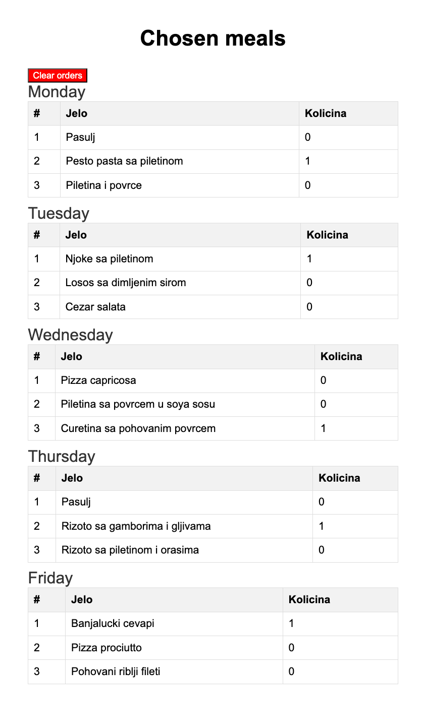

## Exercise 4: Weekly meal planner website
Create a web application allowing users to select meals for each day of the week and providing an overview of selected meals for the client.

### Scenario
1. **Meal Selection**: Users choose a meal for each weekday from a predefined set. After confirmation, the selection is saved, and users receive confirmation. Users are rembembered using **cookies**.
2. **Order Overview**: The client's page shows the quantity of ordered meals grouped by days and allows deleting all orders.

### Technical Requirements
- Use Servlet API for the web application.
- Load meals from files at server startup.
- Ensure users can select each meal once per session.
- Protect access to the selected meals page with a password passed as a query parameter: `http://localhost:8080/chosen-meals?password=lozinkica`

### Running the app
Deploy the app to a **Tomcat 9 web server**. Set the following:
1. Before launch: build 'example_4.war' artifact
2. Deploy at the server startup: example_4:war
3. Application context: ""

  
   

