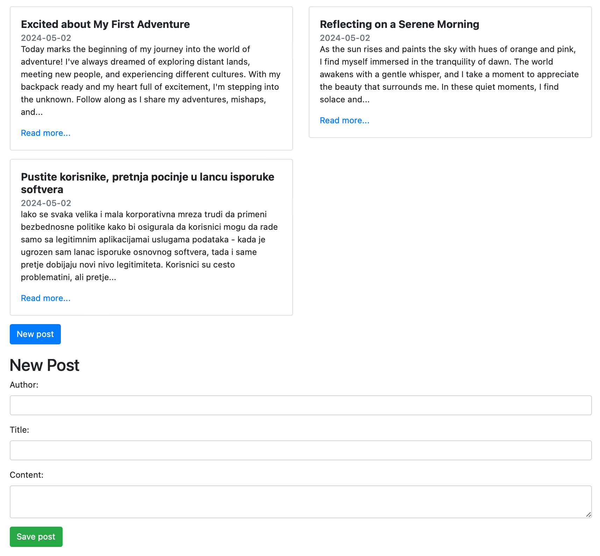
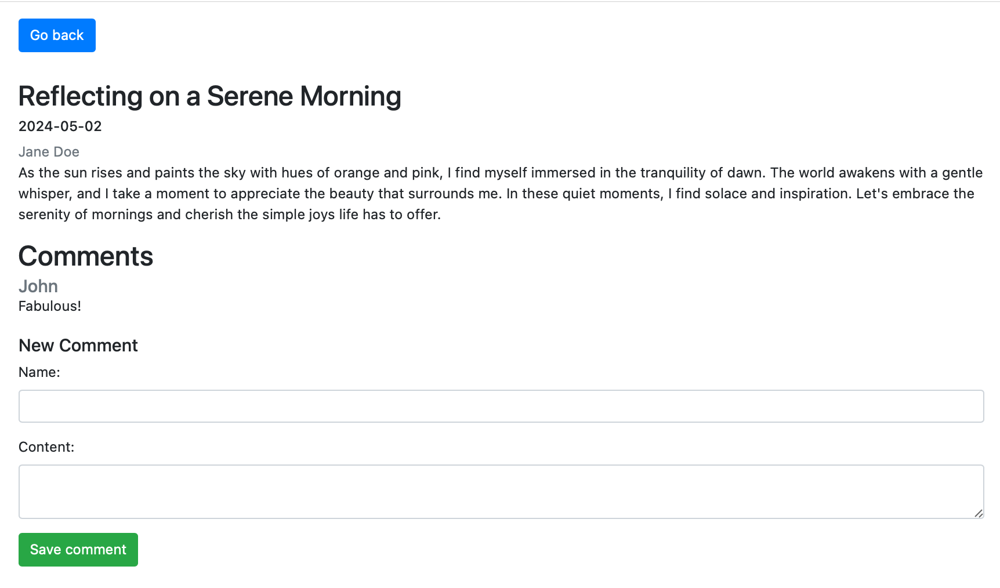

## Exercise 5: Public blog
Develop a public platform for posting news/articles where users can add posts containing author name, title, and content. All users have access to published posts, can read them, and leave comments.

### Scenario
1. **List of Published Posts**: The main page displays all existing posts.The "New post" button on the same page displays a form to create a new post.  
2. **Display of Post Content**: Clicking on a post displays its content on the same page: title, publish date, author, text, comments, and the option to add a new comment. 

### Technical Requirements
- Implement a **single-page** web application.
- Utilize AJAX requests for actions after loading the posts.html page.
- Use JAX-RS specification for implementing the RESTful API on the server side.
- Store posts and their comments in memory.

### Running the app
Deploy the app to a **Tomcat 9 web server**. Set the following:
1. Before launch: build 'example_5.war' artifact
2. Deploy at the server startup: example_5:war
3. Application context: ""

  
   

